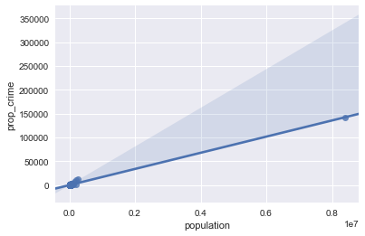
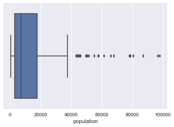
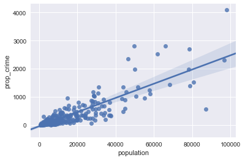
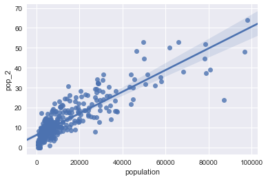

```python
%matplotlib inline
import pandas as pd
import numpy as np
import seaborn as sns
from matplotlib import pyplot as plt
from sklearn import linear_model
import xlrd
pd.options.display.float_format = '{:.3f}'.format
```


```python
file = ('C:\\Users\\Abe\\Data Science Bootcamp\\Unit 2\\Crime\\table_8_offenses_known_to_law_enforcement_new_york_by_city_2013.xls')
df = pd.read_excel(file, header=4)
df.head()
```


<div>
<table border="1" class="dataframe">
  <thead>
    <tr style="text-align: right;">
      <th></th>
      <th>City</th>
      <th>Population</th>
      <th>Violent
crime</th>
      <th>Murder and
nonnegligent
manslaughter</th>
      <th>Rape
(revised
definition)1</th>
      <th>Rape
(legacy
definition)2</th>
      <th>Robbery</th>
      <th>Aggravated
assault</th>
      <th>Property
crime</th>
      <th>Burglary</th>
      <th>Larceny-
theft</th>
      <th>Motor
vehicle
theft</th>
      <th>Arson3</th>
    </tr>
  </thead>
  <tbody>
    <tr>
      <th>0</th>
      <td>Adams Village</td>
      <td>1861</td>
      <td>0</td>
      <td>0</td>
      <td>nan</td>
      <td>0</td>
      <td>0</td>
      <td>0</td>
      <td>12</td>
      <td>2</td>
      <td>10</td>
      <td>0</td>
      <td>0</td>
    </tr>
    <tr>
      <th>1</th>
      <td>Addison Town and Village</td>
      <td>2577</td>
      <td>3</td>
      <td>0</td>
      <td>nan</td>
      <td>0</td>
      <td>0</td>
      <td>3</td>
      <td>24</td>
      <td>3</td>
      <td>20</td>
      <td>1</td>
      <td>0</td>
    </tr>
    <tr>
      <th>2</th>
      <td>Akron Village</td>
      <td>2846</td>
      <td>3</td>
      <td>0</td>
      <td>nan</td>
      <td>0</td>
      <td>0</td>
      <td>3</td>
      <td>16</td>
      <td>1</td>
      <td>15</td>
      <td>0</td>
      <td>0</td>
    </tr>
    <tr>
      <th>3</th>
      <td>Albany</td>
      <td>97956</td>
      <td>791</td>
      <td>8</td>
      <td>nan</td>
      <td>30</td>
      <td>227</td>
      <td>526</td>
      <td>4090</td>
      <td>705</td>
      <td>3243</td>
      <td>142</td>
      <td>nan</td>
    </tr>
    <tr>
      <th>4</th>
      <td>Albion Village</td>
      <td>6388</td>
      <td>23</td>
      <td>0</td>
      <td>nan</td>
      <td>3</td>
      <td>4</td>
      <td>16</td>
      <td>223</td>
      <td>53</td>
      <td>165</td>
      <td>5</td>
      <td>nan</td>
    </tr>
  </tbody>
</table>
</div>


```python
cols = ['city', 'population', 'violent_crime', 'murder_mans','rape1','rape2',
        'robbery', 'agg_ass','prop_crime','burglary','larc_theft','gta','arson']

df.columns = cols
dfcl = df.drop(['rape1','arson'],axis=1)
dfcl = dfcl.dropna()
```


```python
dfcl.head()
```


<div>
<table border="1" class="dataframe">
  <thead>
    <tr style="text-align: right;">
      <th></th>
      <th>city</th>
      <th>population</th>
      <th>violent_crime</th>
      <th>murder_mans</th>
      <th>rape2</th>
      <th>robbery</th>
      <th>agg_ass</th>
      <th>prop_crime</th>
      <th>burglary</th>
      <th>larc_theft</th>
      <th>gta</th>
    </tr>
  </thead>
  <tbody>
    <tr>
      <th>0</th>
      <td>Adams Village</td>
      <td>1861</td>
      <td>0</td>
      <td>0</td>
      <td>0</td>
      <td>0</td>
      <td>0</td>
      <td>12</td>
      <td>2</td>
      <td>10</td>
      <td>0</td>
    </tr>
    <tr>
      <th>1</th>
      <td>Addison Town and Village</td>
      <td>2577</td>
      <td>3</td>
      <td>0</td>
      <td>0</td>
      <td>0</td>
      <td>3</td>
      <td>24</td>
      <td>3</td>
      <td>20</td>
      <td>1</td>
    </tr>
    <tr>
      <th>2</th>
      <td>Akron Village</td>
      <td>2846</td>
      <td>3</td>
      <td>0</td>
      <td>0</td>
      <td>0</td>
      <td>3</td>
      <td>16</td>
      <td>1</td>
      <td>15</td>
      <td>0</td>
    </tr>
    <tr>
      <th>3</th>
      <td>Albany</td>
      <td>97956</td>
      <td>791</td>
      <td>8</td>
      <td>30</td>
      <td>227</td>
      <td>526</td>
      <td>4090</td>
      <td>705</td>
      <td>3243</td>
      <td>142</td>
    </tr>
    <tr>
      <th>4</th>
      <td>Albion Village</td>
      <td>6388</td>
      <td>23</td>
      <td>0</td>
      <td>3</td>
      <td>4</td>
      <td>16</td>
      <td>223</td>
      <td>53</td>
      <td>165</td>
      <td>5</td>
    </tr>
  </tbody>
</table>
</div>


```python
dfcl['popsqd'] = (dfcl['population'] ** 2)
dfcl['murder2'] = np.where(dfcl['murder_mans'] > 0, 1,0)
dfcl['robbery2'] = np.where(dfcl['robbery'] > 0, 1,0)

df_ss = dfcl[['population','popsqd','murder2','robbery2','prop_crime']]
df_ss.head()
```


<div>
<table border="1" class="dataframe">
  <thead>
    <tr style="text-align: right;">
      <th></th>
      <th>population</th>
      <th>popsqd</th>
      <th>murder2</th>
      <th>robbery2</th>
      <th>prop_crime</th>
    </tr>
  </thead>
  <tbody>
    <tr>
      <th>0</th>
      <td>1861.000</td>
      <td>3463321.000</td>
      <td>0</td>
      <td>0</td>
      <td>12.000</td>
    </tr>
    <tr>
      <th>1</th>
      <td>2577.000</td>
      <td>6640929.000</td>
      <td>0</td>
      <td>0</td>
      <td>24.000</td>
    </tr>
    <tr>
      <th>2</th>
      <td>2846.000</td>
      <td>8099716.000</td>
      <td>0</td>
      <td>0</td>
      <td>16.000</td>
    </tr>
    <tr>
      <th>3</th>
      <td>97956.000</td>
      <td>9595377936.000</td>
      <td>1</td>
      <td>1</td>
      <td>4090.000</td>
    </tr>
    <tr>
      <th>4</th>
      <td>6388.000</td>
      <td>40806544.000</td>
      <td>0</td>
      <td>1</td>
      <td>223.000</td>
    </tr>
  </tbody>
</table>
</div>


```python
# Look into correlations
df_ss.corr()
```


<div>
<table border="1" class="dataframe">
  <thead>
    <tr style="text-align: right;">
      <th></th>
      <th>population</th>
      <th>popsqd</th>
      <th>murder2</th>
      <th>robbery2</th>
      <th>prop_crime</th>
    </tr>
  </thead>
  <tbody>
    <tr>
      <th>population</th>
      <td>1.000</td>
      <td>0.998</td>
      <td>0.162</td>
      <td>0.064</td>
      <td>0.996</td>
    </tr>
    <tr>
      <th>popsqd</th>
      <td>0.998</td>
      <td>1.000</td>
      <td>0.133</td>
      <td>0.044</td>
      <td>0.991</td>
    </tr>
    <tr>
      <th>murder2</th>
      <td>0.162</td>
      <td>0.133</td>
      <td>1.000</td>
      <td>0.313</td>
      <td>0.191</td>
    </tr>
    <tr>
      <th>robbery2</th>
      <td>0.064</td>
      <td>0.044</td>
      <td>0.313</td>
      <td>1.000</td>
      <td>0.079</td>
    </tr>
    <tr>
      <th>prop_crime</th>
      <td>0.996</td>
      <td>0.991</td>
      <td>0.191</td>
      <td>0.079</td>
      <td>1.000</td>
    </tr>
  </tbody>
</table>
</div>


```python
# Look at population outliers
# Removed largest city. Maybe remove cities less than 100K and only focus on small cities?
sns.regplot(df_ss.population,df_ss.prop_crime)
plt.show()
```





```python
# Drop the outlier
df_ss.drop(df_ss[df_ss['population'] > 100000].index,inplace=True)
print (df_ss.sort('population',ascending=False))
```

         population         popsqd  murder2  robbery2  prop_crime
    3     97956.000 9595377936.000        1         1    4090.000
    126   96667.000 9344508889.000        0         1    2303.000
    267   87204.000 7604537616.000        1         1     567.000
    57    80705.000 6513297025.000        0         1    1515.000
    214   78800.000 6209440000.000        0         1    1391.000
    53    78361.000 6140446321.000        0         1    2689.000
    62    78215.000 6117586225.000        0         1    1990.000
    206   68071.000 4633661041.000        1         1    1436.000
    285   66041.000 4361413681.000        1         1    2800.000
    321   61686.000 3805162596.000        1         1    2528.000
    314   58082.000 3373518724.000        1         1    1099.000
    340   57559.000 3313038481.000        1         1    1232.000
    140   55198.000 3046819204.000        1         1     958.000
    152   51506.000 2652868036.000        1         1    1353.000
    301   50603.000 2560663609.000        0         1    1020.000
    315   49898.000 2489810404.000        1         1    1985.000
    218   49574.000 2457581476.000        1         1    2807.000
    22    46304.000 2144060416.000        1         1    2349.000
    134   45535.000 2073436225.000        1         1    1167.000
    338   44821.000 2008922041.000        1         1     896.000
    127   44787.000 2005875369.000        1         1     578.000
    263   43866.000 1924225956.000        1         1    1339.000
    334   43777.000 1916425729.000        0         1     469.000
    108   43214.000 1867449796.000        0         1     933.000
    236   37438.000 1401603844.000        0         1     317.000
    139   37196.000 1383542416.000        0         1     340.000
    31    36689.000 1346082721.000        1         1     793.000
    347   36643.000 1342709449.000        0         1     334.000
    167   36369.000 1322704161.000        0         1     547.000
    45    34462.000 1187629444.000        0         0     198.000
    ..          ...            ...      ...       ...         ...
    307    1691.000    2859481.000        0         0      47.000
    186    1688.000    2849344.000        0         0       0.000
    75     1628.000    2650384.000        0         0      14.000
    208    1622.000    2630884.000        0         0       0.000
    258    1602.000    2566404.000        0         0      31.000
    128    1553.000    2411809.000        0         0       1.000
    295    1437.000    2064969.000        0         0       0.000
    242    1433.000    2053489.000        0         1      13.000
    149    1428.000    2039184.000        0         0      12.000
    23     1410.000    1988100.000        0         0      14.000
    238    1385.000    1918225.000        0         0      10.000
    293    1351.000    1825201.000        0         0      15.000
    157    1350.000    1822500.000        0         0       2.000
    256    1274.000    1623076.000        0         0       0.000
    200    1263.000    1595169.000        0         0      15.000
    34     1174.000    1378276.000        0         0      10.000
    77     1122.000    1258884.000        0         0       8.000
    87     1104.000    1218816.000        0         0      66.000
    227    1097.000    1203409.000        0         0       1.000
    25     1022.000    1044484.000        0         0       4.000
    260     997.000     994009.000        0         0       8.000
    48      980.000     960400.000        0         0       4.000
    266     977.000     954529.000        0         0      41.000
    287     872.000     760384.000        0         0       0.000
    344     829.000     687241.000        0         0      17.000
    44      762.000     580644.000        0         0       2.000
    12      658.000     432964.000        0         0       2.000
    136     656.000     430336.000        0         0      10.000
    319     615.000     378225.000        0         0       0.000
    118     526.000     276676.000        0         0       5.000
    
    [340 rows x 5 columns]
    

    c:\users\abe\appdata\local\programs\python\python36-32\lib\site-packages\ipykernel\__main__.py:2: SettingWithCopyWarning: 
    A value is trying to be set on a copy of a slice from a DataFrame
    
    See the caveats in the documentation: http://pandas.pydata.org/pandas-docs/stable/indexing.html#indexing-view-versus-copy
      from ipykernel import kernelapp as app
    c:\users\abe\appdata\local\programs\python\python36-32\lib\site-packages\ipykernel\__main__.py:3: FutureWarning: sort(columns=....) is deprecated, use sort_values(by=.....)
      app.launch_new_instance()
    


```python
# Look at population again

print(df_ss.population.describe())
sns.boxplot(df_ss.population)
plt.show()

sns.regplot(df_ss.population, df_ss.prop_crime)
plt.show()
```

    count     340.000
    mean    13535.050
    std     16664.734
    min       526.000
    25%      3003.000
    50%      7106.000
    75%     17686.250
    max     97956.000
    Name: population, dtype: float64
    








```python
df_ss['pop_2'] = np.sqrt(df_ss['prop_crime'])

sns.regplot(df_ss.population, df_ss.pop_2)
plt.show()

df_ss.head()
```

    c:\users\abe\appdata\local\programs\python\python36-32\lib\site-packages\ipykernel\__main__.py:1: SettingWithCopyWarning: 
    A value is trying to be set on a copy of a slice from a DataFrame.
    Try using .loc[row_indexer,col_indexer] = value instead
    
    See the caveats in the documentation: http://pandas.pydata.org/pandas-docs/stable/indexing.html#indexing-view-versus-copy
      if __name__ == '__main__':
    





<div>
<table border="1" class="dataframe">
  <thead>
    <tr style="text-align: right;">
      <th></th>
      <th>population</th>
      <th>popsqd</th>
      <th>murder2</th>
      <th>robbery2</th>
      <th>prop_crime</th>
      <th>pop_2</th>
    </tr>
  </thead>
  <tbody>
    <tr>
      <th>2</th>
      <td>2846.000</td>
      <td>8099716.000</td>
      <td>0</td>
      <td>0</td>
      <td>16.000</td>
      <td>4.000</td>
    </tr>
    <tr>
      <th>3</th>
      <td>97956.000</td>
      <td>9595377936.000</td>
      <td>1</td>
      <td>1</td>
      <td>4090.000</td>
      <td>63.953</td>
    </tr>
    <tr>
      <th>4</th>
      <td>6388.000</td>
      <td>40806544.000</td>
      <td>0</td>
      <td>1</td>
      <td>223.000</td>
      <td>14.933</td>
    </tr>
    <tr>
      <th>5</th>
      <td>4089.000</td>
      <td>16719921.000</td>
      <td>0</td>
      <td>1</td>
      <td>46.000</td>
      <td>6.782</td>
    </tr>
    <tr>
      <th>6</th>
      <td>1781.000</td>
      <td>3171961.000</td>
      <td>0</td>
      <td>0</td>
      <td>10.000</td>
      <td>3.162</td>
    </tr>
  </tbody>
</table>
</div>


```python
# Lets look at the regression

regr = linear_model.LinearRegression()

x = df_ss[['population','popsqd','murder2','robbery2']]
y = df_ss['pop_2']

regr.fit(x, y)

print ('Coefficients: \n', regr.coef_)
print('Intercept: \n', regr.intercept_)

```

    Coefficients: 
     [  5.66997725e-04  -1.65056996e-09   2.94750675e+00   4.62369569e+00]
    Intercept: 
     3.54719667273
    
