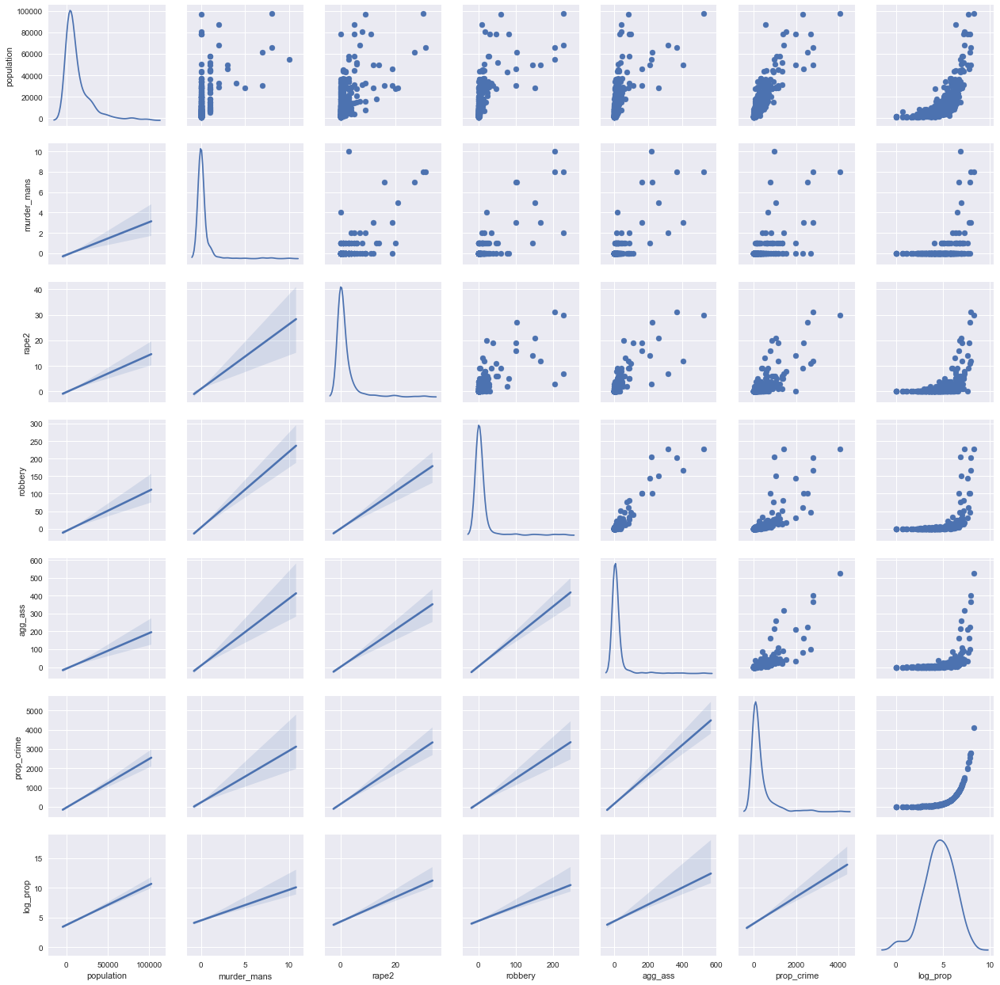

```python
%matplotlib inline
import pandas as pd
import numpy as np
import seaborn as sns
from matplotlib import pyplot as plt
from sklearn import linear_model
import xlrd
from sklearn.decomposition import PCA 
pd.options.display.float_format = '{:.3f}'.format
```


```python
file = ('C:\\Users\\Abe\\Data Science Bootcamp\\Unit 2\\Crime\\table_8_offenses_known_to_law_enforcement_new_york_by_city_2013.xls')
df = pd.read_excel(file, header=4)
df.head()
```


<div>
<table border="1" class="dataframe">
  <thead>
    <tr style="text-align: right;">
      <th></th>
      <th>City</th>
      <th>Population</th>
      <th>Violent
crime</th>
      <th>Murder and
nonnegligent
manslaughter</th>
      <th>Rape
(revised
definition)1</th>
      <th>Rape
(legacy
definition)2</th>
      <th>Robbery</th>
      <th>Aggravated
assault</th>
      <th>Property
crime</th>
      <th>Burglary</th>
      <th>Larceny-
theft</th>
      <th>Motor
vehicle
theft</th>
      <th>Arson3</th>
    </tr>
  </thead>
  <tbody>
    <tr>
      <th>0</th>
      <td>Adams Village</td>
      <td>1861.000</td>
      <td>0.000</td>
      <td>0.000</td>
      <td>nan</td>
      <td>0.000</td>
      <td>0.000</td>
      <td>0.000</td>
      <td>12.000</td>
      <td>2.000</td>
      <td>10.000</td>
      <td>0.000</td>
      <td>0.000</td>
    </tr>
    <tr>
      <th>1</th>
      <td>Addison Town and Village</td>
      <td>2577.000</td>
      <td>3.000</td>
      <td>0.000</td>
      <td>nan</td>
      <td>0.000</td>
      <td>0.000</td>
      <td>3.000</td>
      <td>24.000</td>
      <td>3.000</td>
      <td>20.000</td>
      <td>1.000</td>
      <td>0.000</td>
    </tr>
    <tr>
      <th>2</th>
      <td>Akron Village</td>
      <td>2846.000</td>
      <td>3.000</td>
      <td>0.000</td>
      <td>nan</td>
      <td>0.000</td>
      <td>0.000</td>
      <td>3.000</td>
      <td>16.000</td>
      <td>1.000</td>
      <td>15.000</td>
      <td>0.000</td>
      <td>0.000</td>
    </tr>
    <tr>
      <th>3</th>
      <td>Albany</td>
      <td>97956.000</td>
      <td>791.000</td>
      <td>8.000</td>
      <td>nan</td>
      <td>30.000</td>
      <td>227.000</td>
      <td>526.000</td>
      <td>4090.000</td>
      <td>705.000</td>
      <td>3243.000</td>
      <td>142.000</td>
      <td>nan</td>
    </tr>
    <tr>
      <th>4</th>
      <td>Albion Village</td>
      <td>6388.000</td>
      <td>23.000</td>
      <td>0.000</td>
      <td>nan</td>
      <td>3.000</td>
      <td>4.000</td>
      <td>16.000</td>
      <td>223.000</td>
      <td>53.000</td>
      <td>165.000</td>
      <td>5.000</td>
      <td>nan</td>
    </tr>
  </tbody>
</table>
</div>


```python
cols = ['city', 'population', 'violent_crime', 'murder_mans','rape1','rape2',
        'robbery', 'agg_ass','prop_crime','burglary','larc_theft','gta','arson']

df.columns = cols
dfcl = df.drop(['rape1','arson'],axis=1)
dfcl = dfcl.dropna()
dfcl.drop(dfcl[dfcl['population'] > 100000].index,inplace=True)
```


```python
dfcl.head()
```


<div>
<table border="1" class="dataframe">
  <thead>
    <tr style="text-align: right;">
      <th></th>
      <th>city</th>
      <th>population</th>
      <th>violent_crime</th>
      <th>murder_mans</th>
      <th>rape2</th>
      <th>robbery</th>
      <th>agg_ass</th>
      <th>prop_crime</th>
      <th>burglary</th>
      <th>larc_theft</th>
      <th>gta</th>
    </tr>
  </thead>
  <tbody>
    <tr>
      <th>0</th>
      <td>Adams Village</td>
      <td>1861.000</td>
      <td>0.000</td>
      <td>0.000</td>
      <td>0.000</td>
      <td>0.000</td>
      <td>0.000</td>
      <td>12.000</td>
      <td>2.000</td>
      <td>10.000</td>
      <td>0.000</td>
    </tr>
    <tr>
      <th>1</th>
      <td>Addison Town and Village</td>
      <td>2577.000</td>
      <td>3.000</td>
      <td>0.000</td>
      <td>0.000</td>
      <td>0.000</td>
      <td>3.000</td>
      <td>24.000</td>
      <td>3.000</td>
      <td>20.000</td>
      <td>1.000</td>
    </tr>
    <tr>
      <th>2</th>
      <td>Akron Village</td>
      <td>2846.000</td>
      <td>3.000</td>
      <td>0.000</td>
      <td>0.000</td>
      <td>0.000</td>
      <td>3.000</td>
      <td>16.000</td>
      <td>1.000</td>
      <td>15.000</td>
      <td>0.000</td>
    </tr>
    <tr>
      <th>3</th>
      <td>Albany</td>
      <td>97956.000</td>
      <td>791.000</td>
      <td>8.000</td>
      <td>30.000</td>
      <td>227.000</td>
      <td>526.000</td>
      <td>4090.000</td>
      <td>705.000</td>
      <td>3243.000</td>
      <td>142.000</td>
    </tr>
    <tr>
      <th>4</th>
      <td>Albion Village</td>
      <td>6388.000</td>
      <td>23.000</td>
      <td>0.000</td>
      <td>3.000</td>
      <td>4.000</td>
      <td>16.000</td>
      <td>223.000</td>
      <td>53.000</td>
      <td>165.000</td>
      <td>5.000</td>
    </tr>
  </tbody>
</table>
</div>


```python
# Correlation of the data set.
# Prop_crime is the aggregation of burglary, larc_theft and gta so we cannot use those in our model
# violent_crime has the same issue

dfcl.drop(['violent_crime','burglary','larc_theft','gta'],axis=1,inplace=True)
dfcl.corr()
```


<div>
<table border="1" class="dataframe">
  <thead>
    <tr style="text-align: right;">
      <th></th>
      <th>population</th>
      <th>murder_mans</th>
      <th>rape2</th>
      <th>robbery</th>
      <th>agg_ass</th>
      <th>prop_crime</th>
    </tr>
  </thead>
  <tbody>
    <tr>
      <th>population</th>
      <td>1.000</td>
      <td>0.490</td>
      <td>0.592</td>
      <td>0.643</td>
      <td>0.627</td>
      <td>0.849</td>
    </tr>
    <tr>
      <th>murder_mans</th>
      <td>0.490</td>
      <td>1.000</td>
      <td>0.680</td>
      <td>0.797</td>
      <td>0.779</td>
      <td>0.593</td>
    </tr>
    <tr>
      <th>rape2</th>
      <td>0.592</td>
      <td>0.680</td>
      <td>1.000</td>
      <td>0.731</td>
      <td>0.810</td>
      <td>0.787</td>
    </tr>
    <tr>
      <th>robbery</th>
      <td>0.643</td>
      <td>0.797</td>
      <td>0.731</td>
      <td>1.000</td>
      <td>0.950</td>
      <td>0.773</td>
    </tr>
    <tr>
      <th>agg_ass</th>
      <td>0.627</td>
      <td>0.779</td>
      <td>0.810</td>
      <td>0.950</td>
      <td>1.000</td>
      <td>0.813</td>
    </tr>
    <tr>
      <th>prop_crime</th>
      <td>0.849</td>
      <td>0.593</td>
      <td>0.787</td>
      <td>0.773</td>
      <td>0.813</td>
      <td>1.000</td>
    </tr>
  </tbody>
</table>
</div>


```python
# Look at population outliers
# Removed largest city. Maybe remove cities less than 100K and only focus on small cities?
g = sns.PairGrid(dfcl, diag_sharey=False)
g.map_upper(plt.scatter)
g.map_lower(sns.regplot, scatter_kws=dict(alpha=0))
g.map_diag(sns.kdeplot)
plt.show()
```

    c:\users\abe\appdata\local\programs\python\python36-32\lib\site-packages\matplotlib\axes\_axes.py:545: UserWarning: No labelled objects found. Use label='...' kwarg on individual plots.
      warnings.warn("No labelled objects found. "
    





```python
# Lets look at the regression

regr = linear_model.LinearRegression()

x = dfcl[['population','murder_mans','rape2','robbery','agg_ass']]
y = dfcl['prop_crime']

regr.fit(x, y)

print ('Coefficients: \n', regr.coef_)
print('Intercept: \n', regr.intercept_)
```

    Coefficients: 
     [  1.57390586e-02  -5.63765634e+01   3.11909156e+01  -1.18553103e+00
       4.10337189e+00]
    Intercept: 
     -20.8374061991
    
