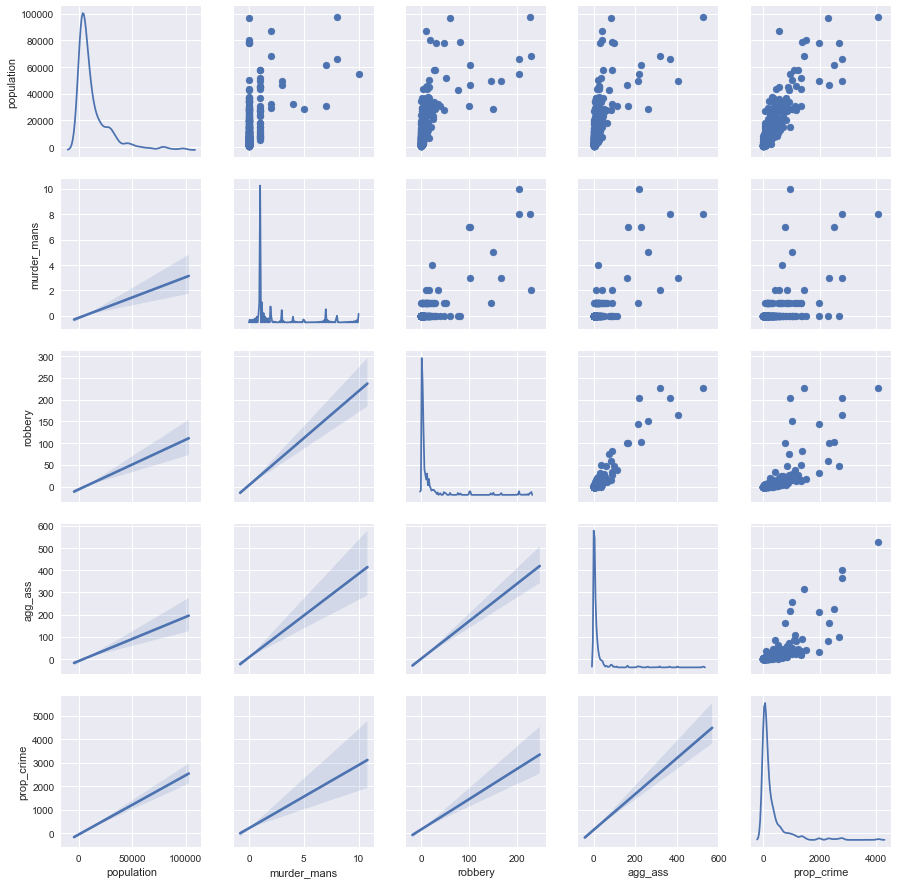

```python
%matplotlib inline
import pandas as pd
import numpy as np
import seaborn as sns
from matplotlib import pyplot as plt
from sklearn.linear_model import (
    LinearRegression, TheilSenRegressor, RANSACRegressor, HuberRegressor)
import xlrd
from sklearn.decomposition import PCA 
import statsmodels.formula.api as smf
from statsmodels.sandbox.regression.predstd import wls_prediction_std
from sklearn.metrics import (mean_squared_error,median_absolute_error)
pd.options.display.float_format = '{:.3f}'.format
```


```python
file = ('C:\\Users\\Abe\\Data Science Bootcamp\\Unit 2\\Crime\\table_8_offenses_known_to_law_enforcement_new_york_by_city_2013.xls')
df = pd.read_excel(file, header=4)
df.head()
```


<div>
<table border="1" class="dataframe">
  <thead>
    <tr style="text-align: right;">
      <th></th>
      <th>City</th>
      <th>Population</th>
      <th>Violent
crime</th>
      <th>Murder and
nonnegligent
manslaughter</th>
      <th>Rape
(revised
definition)1</th>
      <th>Rape
(legacy
definition)2</th>
      <th>Robbery</th>
      <th>Aggravated
assault</th>
      <th>Property
crime</th>
      <th>Burglary</th>
      <th>Larceny-
theft</th>
      <th>Motor
vehicle
theft</th>
      <th>Arson3</th>
    </tr>
  </thead>
  <tbody>
    <tr>
      <th>0</th>
      <td>Adams Village</td>
      <td>1861.000</td>
      <td>0.000</td>
      <td>0.000</td>
      <td>nan</td>
      <td>0.000</td>
      <td>0.000</td>
      <td>0.000</td>
      <td>12.000</td>
      <td>2.000</td>
      <td>10.000</td>
      <td>0.000</td>
      <td>0.000</td>
    </tr>
    <tr>
      <th>1</th>
      <td>Addison Town and Village</td>
      <td>2577.000</td>
      <td>3.000</td>
      <td>0.000</td>
      <td>nan</td>
      <td>0.000</td>
      <td>0.000</td>
      <td>3.000</td>
      <td>24.000</td>
      <td>3.000</td>
      <td>20.000</td>
      <td>1.000</td>
      <td>0.000</td>
    </tr>
    <tr>
      <th>2</th>
      <td>Akron Village</td>
      <td>2846.000</td>
      <td>3.000</td>
      <td>0.000</td>
      <td>nan</td>
      <td>0.000</td>
      <td>0.000</td>
      <td>3.000</td>
      <td>16.000</td>
      <td>1.000</td>
      <td>15.000</td>
      <td>0.000</td>
      <td>0.000</td>
    </tr>
    <tr>
      <th>3</th>
      <td>Albany</td>
      <td>97956.000</td>
      <td>791.000</td>
      <td>8.000</td>
      <td>nan</td>
      <td>30.000</td>
      <td>227.000</td>
      <td>526.000</td>
      <td>4090.000</td>
      <td>705.000</td>
      <td>3243.000</td>
      <td>142.000</td>
      <td>nan</td>
    </tr>
    <tr>
      <th>4</th>
      <td>Albion Village</td>
      <td>6388.000</td>
      <td>23.000</td>
      <td>0.000</td>
      <td>nan</td>
      <td>3.000</td>
      <td>4.000</td>
      <td>16.000</td>
      <td>223.000</td>
      <td>53.000</td>
      <td>165.000</td>
      <td>5.000</td>
      <td>nan</td>
    </tr>
  </tbody>
</table>
</div>


```python
cols = ['city', 'population', 'violent_crime', 'murder_mans','rape1','rape2',
        'robbery', 'agg_ass','prop_crime','burglary','larc_theft','gta','arson']

df.columns = cols
dfcl = df.drop(['rape1','arson'],axis=1)
dfcl = dfcl.dropna()
dfcl.drop(dfcl[dfcl['population'] > 100000].index,inplace=True)
```


```python
dfcl.head()
```


<div>
<table border="1" class="dataframe">
  <thead>
    <tr style="text-align: right;">
      <th></th>
      <th>city</th>
      <th>population</th>
      <th>violent_crime</th>
      <th>murder_mans</th>
      <th>rape2</th>
      <th>robbery</th>
      <th>agg_ass</th>
      <th>prop_crime</th>
      <th>burglary</th>
      <th>larc_theft</th>
      <th>gta</th>
    </tr>
  </thead>
  <tbody>
    <tr>
      <th>0</th>
      <td>Adams Village</td>
      <td>1861.000</td>
      <td>0.000</td>
      <td>0.000</td>
      <td>0.000</td>
      <td>0.000</td>
      <td>0.000</td>
      <td>12.000</td>
      <td>2.000</td>
      <td>10.000</td>
      <td>0.000</td>
    </tr>
    <tr>
      <th>1</th>
      <td>Addison Town and Village</td>
      <td>2577.000</td>
      <td>3.000</td>
      <td>0.000</td>
      <td>0.000</td>
      <td>0.000</td>
      <td>3.000</td>
      <td>24.000</td>
      <td>3.000</td>
      <td>20.000</td>
      <td>1.000</td>
    </tr>
    <tr>
      <th>2</th>
      <td>Akron Village</td>
      <td>2846.000</td>
      <td>3.000</td>
      <td>0.000</td>
      <td>0.000</td>
      <td>0.000</td>
      <td>3.000</td>
      <td>16.000</td>
      <td>1.000</td>
      <td>15.000</td>
      <td>0.000</td>
    </tr>
    <tr>
      <th>3</th>
      <td>Albany</td>
      <td>97956.000</td>
      <td>791.000</td>
      <td>8.000</td>
      <td>30.000</td>
      <td>227.000</td>
      <td>526.000</td>
      <td>4090.000</td>
      <td>705.000</td>
      <td>3243.000</td>
      <td>142.000</td>
    </tr>
    <tr>
      <th>4</th>
      <td>Albion Village</td>
      <td>6388.000</td>
      <td>23.000</td>
      <td>0.000</td>
      <td>3.000</td>
      <td>4.000</td>
      <td>16.000</td>
      <td>223.000</td>
      <td>53.000</td>
      <td>165.000</td>
      <td>5.000</td>
    </tr>
  </tbody>
</table>
</div>


```python
# Correlation of the data set.
# Prop_crime is the aggregation of burglary, larc_theft and gta so we cannot use those in our model
# violent_crime has the same issue

dfcl.drop(['violent_crime','burglary','larc_theft','gta','rape2'],axis=1,inplace=True)
dfcl.corr()
```


<div>
<table border="1" class="dataframe">
  <thead>
    <tr style="text-align: right;">
      <th></th>
      <th>population</th>
      <th>murder_mans</th>
      <th>robbery</th>
      <th>agg_ass</th>
      <th>prop_crime</th>
    </tr>
  </thead>
  <tbody>
    <tr>
      <th>population</th>
      <td>1.000</td>
      <td>0.490</td>
      <td>0.643</td>
      <td>0.627</td>
      <td>0.849</td>
    </tr>
    <tr>
      <th>murder_mans</th>
      <td>0.490</td>
      <td>1.000</td>
      <td>0.797</td>
      <td>0.779</td>
      <td>0.593</td>
    </tr>
    <tr>
      <th>robbery</th>
      <td>0.643</td>
      <td>0.797</td>
      <td>1.000</td>
      <td>0.950</td>
      <td>0.773</td>
    </tr>
    <tr>
      <th>agg_ass</th>
      <td>0.627</td>
      <td>0.779</td>
      <td>0.950</td>
      <td>1.000</td>
      <td>0.813</td>
    </tr>
    <tr>
      <th>prop_crime</th>
      <td>0.849</td>
      <td>0.593</td>
      <td>0.773</td>
      <td>0.813</td>
      <td>1.000</td>
    </tr>
  </tbody>
</table>
</div>


```python
# Look at population outliers
# Removed largest city. Maybe remove cities less than 100K and only focus on small cities?
g = sns.PairGrid(dfcl, diag_sharey=False)
g.map_upper(plt.scatter)
g.map_lower(sns.regplot, scatter_kws=dict(alpha=0))
g.map_diag(sns.kdeplot)
plt.show()
```

    c:\users\abe\appdata\local\programs\python\python36-32\lib\site-packages\matplotlib\axes\_axes.py:545: UserWarning: No labelled objects found. Use label='...' kwarg on individual plots.
      warnings.warn("No labelled objects found. "
    





```python
# Using statsmodels

linear_formula = 'prop_crime~population+murder_mans+robbery+agg_ass'
lm = smf.ols(formula=linear_formula, data=dfcl).fit()

print('R^2:\n{}\n'.format(lm.rsquared))
print('P Values:\n{}\n'.format(lm.pvalues))
print('Beta Values:\n{}\n'.format(lm.params))
lm.conf_int()
```

    R^2:
    0.858890834232392
    
    P Values:
    Intercept     0.179
    population    0.000
    murder_mans   0.041
    robbery       0.001
    agg_ass       0.000
    dtype: float64
    
    Beta Values:
    Intercept     -17.976
    population      0.017
    murder_mans   -31.720
    robbery        -3.798
    agg_ass         6.769
    dtype: float64
    
    


<div>
<table border="1" class="dataframe">
  <thead>
    <tr style="text-align: right;">
      <th></th>
      <th>0</th>
      <th>1</th>
    </tr>
  </thead>
  <tbody>
    <tr>
      <th>Intercept</th>
      <td>-44.242</td>
      <td>8.290</td>
    </tr>
    <tr>
      <th>population</th>
      <td>0.016</td>
      <td>0.019</td>
    </tr>
    <tr>
      <th>murder_mans</th>
      <td>-62.167</td>
      <td>-1.272</td>
    </tr>
    <tr>
      <th>robbery</th>
      <td>-6.092</td>
      <td>-1.503</td>
    </tr>
    <tr>
      <th>agg_ass</th>
      <td>5.549</td>
      <td>7.989</td>
    </tr>
  </tbody>
</table>
</div>


```python
# Predicting 2014 property crime

regr = LinearRegression()

predictors = ['population','murder_mans','robbery','agg_ass']

x = dfcl[predictors]
y = dfcl['prop_crime']

regr.fit(x, y)

# Import 2014 data
file = 'C:\\Users\\Abe\\Data Science Bootcamp\\Unit 2\\Crime\\Table_8_Offenses_Known_to_Law_Enforcement_by_New_York_by_City_2014.xls'
df2014 = pd.read_excel(file, header=4)
df2014.columns = cols
dfcl2014 = df2014.drop(['rape1','arson','rape2'],axis=1)
dfcl2014 = dfcl2014.dropna()
dfcl2014.drop(dfcl2014[dfcl2014['population'] > 100000].index,inplace=True)

y_true = dfcl2014['prop_crime']
y_predict = regr.predict(dfcl2014[predictors])

print(mean_squared_error(y_true,y_predict))
print(median_absolute_error(y_true,y_predict))
print(regr.predict(dfcl2014[predictors].ix[200:201]))
print(dfcl2014['prop_crime'].ix[200:201])
```

    34889.3368918
    46.8554908421
    [ 185.99606754  225.38324339]
    200    93.000
    201   332.000
    Name: prop_crime, dtype: float64
    


```python
# What would happen if I used per capita features for crime instead of total?

cols = ['murder_mans','robbery','agg_ass']

for col in cols:
    dfcl[col + '/pop'] = dfcl[col] / dfcl['population']
    
df_ss = dfcl.drop(cols,axis=1)

g = sns.PairGrid(df_ss, diag_sharey=False)
g.map_upper(plt.scatter)
g.map_lower(sns.regplot, scatter_kws=dict(alpha=0))
g.map_diag(sns.kdeplot)
plt.show()
```

    c:\users\abe\appdata\local\programs\python\python36-32\lib\site-packages\matplotlib\axes\_axes.py:545: UserWarning: No labelled objects found. Use label='...' kwarg on individual plots.
      warnings.warn("No labelled objects found. "
    


```python
# Fit the model with new variables and try and predict prop_crime in 2014 data again
regr = LinearRegression()

predictors = ['population','murder_mans/pop','robbery/pop','agg_ass/pop']

x = df_ss[predictors]
y = df_ss['prop_crime']
regr.fit(x, y)

# Create predictor columns in 2014 data
for col in cols:
    dfcl2014[col + '/pop'] = dfcl2014[col] / dfcl2014['population']


# y_true is the same as before
y_predict = regr.predict(dfcl2014[predictors])

print(mean_squared_error(y_true,y_predict))
print(median_absolute_error(y_true,y_predict))
print(regr.predict(dfcl2014[predictors].ix[200:201]))
print(dfcl2014['prop_crime'].ix[200:201])
```

    49147.8008178
    77.1316144892
    [ 141.34190878  280.44780925]
    200    93.000
    201   332.000
    Name: prop_crime, dtype: float64
    


```python
# No! Its worse!
# Let's look at the effect of just population

x = dfcl['population']
y = dfcl['prop_crime']

regr.fit(x.to_frame(),y.to_frame())

y_predict = regr.predict(dfcl2014['population'].to_frame())

print(mean_squared_error(y_true,y_predict))
print(median_absolute_error(y_true,y_predict))
print(regr.predict(dfcl2014['population'].ix[200:201].to_frame()))
print(dfcl2014['prop_crime'].ix[200:201])
```

    63105.1818046
    55.2506999571
    [[ 174.09653551]
     [ 225.73333656]]
    200    93.000
    201   332.000
    Name: prop_crime, dtype: float64
    


```python
# I've iterated the wrong way...
```
