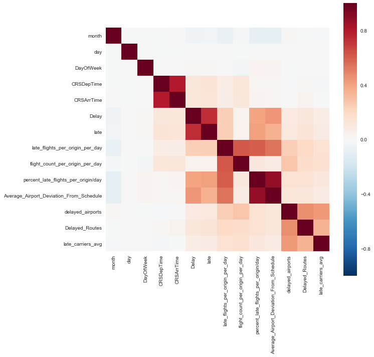

```python
import numpy as np
import pandas as pd
import datetime
from matplotlib import pyplot as plt
import seaborn as sns
```

# Airline Arrivals

The purpose of this project is to predict flight arrival times. We will consider a flight that is delayed by 30 minutes or more as a late flight.

## The Data

The dataset contains information which someone who is trying to predict arrival times will not have. For example: "Reason for Cancellation". I will only import columns where it is reasonable to assume the information will be available before the flight will occur. The meat of this project will be creating useful features which help the model estimate flight arrival times.


```python
file = 'C:\\Users\\Abe\\Data Science Bootcamp\\Unit 3\\Potpourrie\\Airplanes\\2008_20.csv'

# Import these columns
use_me = [
'Year',
'Month',
'DayofMonth',
'DayOfWeek',
'CRSDepTime',
'CRSArrTime',
'UniqueCarrier',
'Origin',
'Dest',
'ArrDelay'
]

df = pd.read_csv(file, usecols=use_me)
df.shape
```


    (1401560, 10)


```python
# Create Date Feature
df.rename(columns={'Year':'year','Month':'month','DayofMonth':'day','ArrDelay':'Delay'},inplace=True)
df['Date'] = pd.to_datetime(df[['year','month','day']])
df.drop('year',axis=1,inplace=True)
df.dropna(inplace=True)

# Combine Origin and Destination to create feature for route
df['Route'] = df['Origin'] + df['Dest']

# Look at percentage of delays
print('Total Percentage of Late Flights:')
df[df['Delay'] > 30].shape[0] / df.shape[0]
```

    Total Percentage of Late Flights:
    


    0.1319281845249818


```python
categorical = df.select_dtypes(include=['object'])
for col in categorical:
    column_ = categorical[col]
    print(col)
    print(column_.nunique())
```

    UniqueCarrier
    20
    Origin
    301
    Dest
    302
    Route
    5033
    


```python
# Create indicator column for late flights
df['late'] = df['Delay'] >= 30
```

## Daily Airport Data

The first place we should start is looking at daily airport traffic. It makes sense intuitively that when an airport is busy there will probably be more delays. We'll start by looking at the percentage of late flights per airport as traffic increases. We'll also look at how the average lateness changes as an airport has more flights.


```python
# Look at how the amount of daily traffic affects lateness at airports
flight_data = df[['Date','Origin','late']].groupby(by=['Date','Origin']).agg(['sum','count','mean'])
x=flight_data[('late','count')]
y=flight_data[('late','mean')]

sns.regplot(x=x, y=y,line_kws={'color':'black'})
plt.xlabel('Daily Flights')
plt.ylabel('Percentage Late')
plt.title('Daily Late Flights')
plt.show()

# Create features for number of flights / airport / day
late_flight_count = df[['Date','Origin','late']].groupby(by=['Date','Origin']).transform('sum')
flight_count = df[['Date','Origin','late']].groupby(by=['Date','Origin']).transform('count')

df['late_flights_per_origin_per_day'] = late_flight_count
df['flight_count_per_origin_per_day'] = flight_count
df['percent_late_flights_per_origin/day'] = late_flight_count / flight_count
```


```python
# Look at how the amount of daily traffic affects time delay at airports
# Similar to cell above but use continuous value for time instead of late indicator
flight_data = df[['Date','Origin','Delay']].groupby(by=['Date','Origin']).agg(['sum','count','mean'])
x=flight_data[('Delay','count')]
y=flight_data[('Delay','mean')]

sns.regplot(x=x, y=y,line_kws={'color':'black'})
plt.xlabel('Daily Flights')
plt.ylabel('Average Deviation From Schedule')
plt.title('Daily Average Lateness')
plt.show()

# Add feature to show 
AAD = df[['Date','Origin','Delay']].groupby(by=['Date','Origin']).transform('mean')
df['Average_Airport_Deviation_From_Schedule'] = AAD
```


## Aggregate Airport Data

Aggregate data can also be helpful when training our model. While daily data has more variance, we might be able to grab some low hanging fruit here by identifying airports which are consistantly delayed. Again, we will look at lateness as total airport traffic increases and create features to note if an airport is on the late end of the spectrum. We'll also look at route data to see if certain routes are later than others.


```python
# Create data frames to calculate average delay per airport for origin and destinations
orig = df[['Origin','Delay']].groupby(by='Origin').agg(['mean','count'])
dest = df[['Dest','Delay']].groupby(by='Dest').agg(['mean','count'])

# Look at average lateness by the amount of traffic per airport
sns.regplot(x=dest[('Delay','count')],y=dest[('Delay','mean')], line_kws={'color':'black'})
plt.xlabel('Total Traffic')
plt.ylabel('Average Minutes Late')
plt.title('Average Lateness by Total Airport Traffic')
plt.show()
```


```python
# Create indicator for airports which are more late on average
q3_dest = dest[('Delay','mean')].quantile(.75)
q3_orig = orig[('Delay','mean')].quantile(.75)

delayed_airports = orig[orig[('Delay','mean')] > q3_orig].index
delayed_airports.append(dest[dest[('Delay','mean')] > q3_dest].index)

df['delayed_airports'] = df['Dest'].isin(delayed_airports) | df['Origin'].isin(delayed_airports)
```


```python
# Look at late Routes on average and create an indicator for if the route is late more than 75% of its peers
late_routes = df[['late','Route']].groupby(by='Route').mean()
q3_routes = late_routes[late_routes['late'] > late_routes['late'].quantile(.75)].index
df['Delayed_Routes'] = df['Route'].isin(q3_routes)
```

## Aggregate Carrier Data

Airport traffic can affect flight delays significantly, but some airlines are just better at staying on time than others. Better maintenance, employees and operations can all improve on-time flights. We'll make a feature which tells the model what each carriers average lateness is.


```python
# Plot average lateness per carrier
late_carriers_plot = df[['late','UniqueCarrier']].groupby('UniqueCarrier').agg(['sum','count','mean'])
x = late_carriers_plot[('late','count')]
y = late_carriers_plot[('late','mean')]

sns.regplot(x=x,y=y)
plt.xlabel('Total Flights')
plt.ylabel('Average Lateness')
plt.title('Average Carrier Lateness by Total Flights')
plt.show()

# Create columns for total late flights per carrier, total flights per carrier and average late flights per carrier
late_carriers_sum = df[['late','UniqueCarrier']].groupby('UniqueCarrier').transform('sum')
late_carriers_count = df[['late','UniqueCarrier']].groupby('UniqueCarrier').transform('count')

df['late_carriers_avg'] = late_carriers_sum / late_carriers_count
```


```python
plt.figure(figsize=(10,10))
sns.heatmap(df.corr(),square=True)
plt.show()

df.corr()['Delay']
```





    month                                     -0.040809
    day                                        0.002612
    DayOfWeek                                  0.010522
    CRSDepTime                                 0.116868
    CRSArrTime                                 0.113173
    Delay                                      1.000000
    late                                       0.737467
    late_flights_per_origin_per_day            0.240045
    flight_count_per_origin_per_day            0.036939
    percent_late_flights_per_origin/day        0.390719
    Average_Airport_Deviation_From_Schedule    0.443042
    delayed_airports                           0.086229
    Delayed_Routes                             0.116847
    late_carriers_avg                          0.077793
    Name: Delay, dtype: float64


## Delays by Month and Day of the Week

Airport traffic varies greatly by the months and by the days of the week. More people travel on holidays and over the weekends which increase the chances of flights being delayed. We'll look at this visually and then create features for the model by turning them into dummy variables.


```python
# Replace Numbers with Days and Months
days = ['Monday','Tuesday','Wednesday','Thursday','Friday','Saturday','Sunday']
months = ['Jan','Feb','Mar','Apr','May','Jun','Jul','Aug','Sep','Oct','Nov','Dec']

df['DayOfWeek'].replace([1,2,3,4,5,6,7],days,inplace=True)
df['month'].replace([1,2,3,4,5,6,7,8,9,10,11,12],months,inplace=True)

sns.barplot(x=df['DayOfWeek'],y=df['late'],order=days)
plt.show()

sns.barplot(x=df['month'],y=df['late'],order=months)
plt.show()
```


```python
# Drop columns which we don't want to run dummies on and other non-essential columns
drop_me = list(categorical.columns) + ['Date']
df.drop(drop_me,axis=1,inplace=True)
df.dropna(inplace=True)
```

## Statistical Tests

We will run two tests: One F test to determine if Day of the Week has a significant effect on flight delays and a chisquared test to check if the difference between the actual number of late flights per day are significantly different than the expected amount of late flights using the data set average of ~13%.


```python
# Match lists for days and months to the names of the dummy variables in the df
days = ['DayOfWeek_' + day for day in days]
months = ['month_' + month for month in months]
cols = days + months
```


```python
from scipy import stats

stats.f_oneway(*[values for category, values in df.groupby('DayOfWeek')['Delay']])
```


    F_onewayResult(statistic=404.26863105841505, pvalue=0.0)


```python
# Figure out how many flights were on each day
flights_per_day = df.groupby('DayOfWeek').size()

# Calculate the expected values for late flights using the average for the data set
exp_late_flights = (flights_per_day*.1319281845249818).astype(int)

# Create a variable which contains the actual amount of late flights 
actual_late_flights = df.groupby('DayOfWeek')['late'].sum().astype(int)

days = ['Monday','Tuesday','Wednesday','Thursday','Friday','Saturday','Sunday']

sorted_exp_late_flights = [exp_late_flights[day] for day in days]
sorted_actual_late_flights = [actual_late_flights[day] for day in days]
```


```python
# Plot the expected amount of late flights per day against the actual late flights for visual inspection
# Then run a chisquared test to determine if there is significance between them
df_plot = pd.DataFrame(data={'Days':days,
                             'Expected Late Flights':sorted_exp_late_flights,
                             'Actual Late Flights':sorted_actual_late_flights})
df_plot = pd.melt(df_plot,id_vars='Days')
sns.factorplot(x='Days',y='value',data=df_plot,hue='variable',kind='bar',size=6)
plt.show()

stats.chisquare(sorted_actual_late_flights, sorted_exp_late_flights)
```


    Power_divergenceResult(statistic=1793.9158470614718, pvalue=0.0)


```python
df = pd.get_dummies(df)
df.info()
```

    <class 'pandas.core.frame.DataFrame'>
    Int64Index: 1370958 entries, 0 to 1401559
    Data columns (total 31 columns):
    day                                        1370958 non-null int64
    CRSDepTime                                 1370958 non-null int64
    CRSArrTime                                 1370958 non-null int64
    Delay                                      1370958 non-null float64
    late                                       1370958 non-null bool
    late_flights_per_origin_per_day            1370958 non-null float64
    flight_count_per_origin_per_day            1370958 non-null int64
    percent_late_flights_per_origin/day        1370958 non-null float64
    Average_Airport_Deviation_From_Schedule    1370958 non-null float64
    delayed_airports                           1370958 non-null bool
    Delayed_Routes                             1370958 non-null bool
    late_carriers_avg                          1370958 non-null float64
    month_Apr                                  1370958 non-null uint8
    month_Aug                                  1370958 non-null uint8
    month_Dec                                  1370958 non-null uint8
    month_Feb                                  1370958 non-null uint8
    month_Jan                                  1370958 non-null uint8
    month_Jul                                  1370958 non-null uint8
    month_Jun                                  1370958 non-null uint8
    month_Mar                                  1370958 non-null uint8
    month_May                                  1370958 non-null uint8
    month_Nov                                  1370958 non-null uint8
    month_Oct                                  1370958 non-null uint8
    month_Sep                                  1370958 non-null uint8
    DayOfWeek_Friday                           1370958 non-null uint8
    DayOfWeek_Monday                           1370958 non-null uint8
    DayOfWeek_Saturday                         1370958 non-null uint8
    DayOfWeek_Sunday                           1370958 non-null uint8
    DayOfWeek_Thursday                         1370958 non-null uint8
    DayOfWeek_Tuesday                          1370958 non-null uint8
    DayOfWeek_Wednesday                        1370958 non-null uint8
    dtypes: bool(3), float64(5), int64(4), uint8(19)
    memory usage: 133.4 MB
    

## Models

We'll focus on decision tree based models.


```python
from sklearn.tree import DecisionTreeRegressor

decision_tree = DecisionTreeRegressor(max_depth=10,
                                      max_features=None)

X = df.loc[:, df.columns != 'Delay']
y = df['Delay']

from sklearn.model_selection import cross_val_score

scre = cross_val_score(decision_tree, X, y, cv=5, scoring='neg_mean_absolute_error')
print(scre)
print(scre.mean())
```

    [-13.92571365 -12.5560312  -13.65403212 -11.15722932 -13.01430319]
    -12.8614618976
    


```python
from sklearn.ensemble import RandomForestRegressor

forest = RandomForestRegressor(max_depth=10,
                               max_features=None)

X = df.loc[:, df.columns != 'Delay']
y = df['Delay']

from sklearn.model_selection import cross_val_score
scre = cross_val_score(forest, X, y, cv=5, scoring='neg_mean_absolute_error')
print(scre)
print(scre.mean())
```

    [-13.76947889 -12.47044216 -13.54466729 -11.0771179  -12.91933598]
    -12.7562084445
    


```python
from sklearn.ensemble import GradientBoostingRegressor

gb_reg = GradientBoostingRegressor(max_depth=3,
                                  n_estimators=50)

X = df.loc[:, df.columns != 'Delay']
y = df['Delay']

from sklearn.model_selection import cross_val_score
scre = cross_val_score(gb_reg, X, y, cv=5, scoring='neg_mean_absolute_error')
print(scre)
print(scre.mean())
```

    [-14.08615276 -12.70036797 -13.78474447 -11.37106748 -13.24123659]
    -13.0367138553
    
