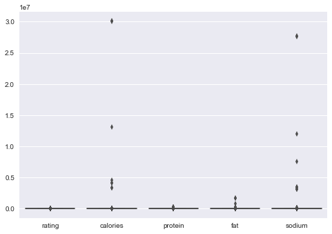
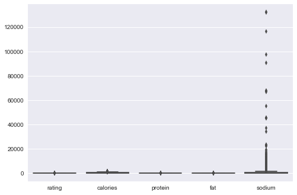
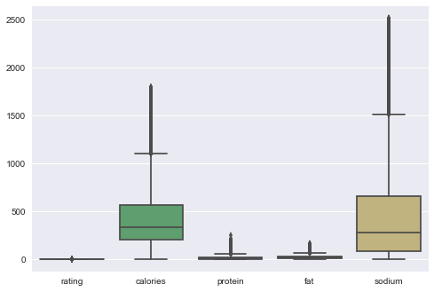
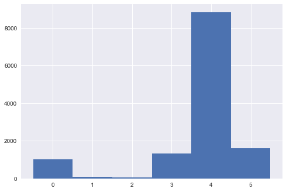
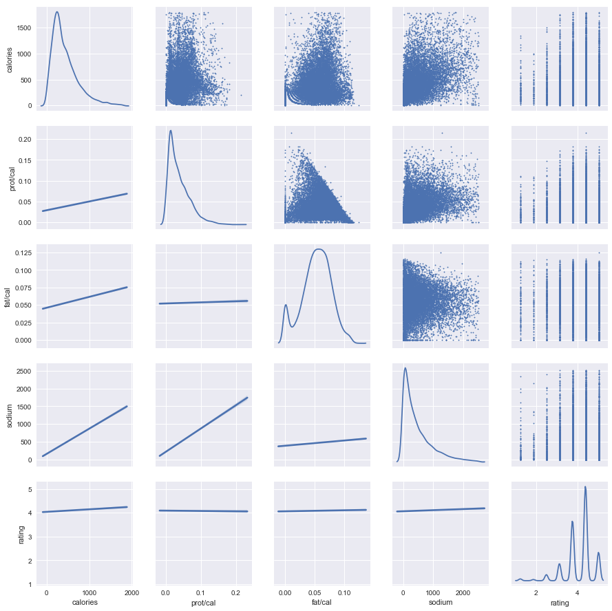

# Comparison Between Linear Regression and Nearest Neighbor on Predicting Recipe Rating from Macro-Nutrients

Dataset sourced from Kaggle:
https://www.kaggle.com/hugodarwood/epirecipes  

You know what they say:  
**Fat + Salt = Flavor...**


```python
import numpy as np
import pandas as pd
import seaborn as sns
from matplotlib import pyplot as plt
from sklearn import neighbors
from sklearn import linear_model
pd.options.display.float_format = '{:.3f}'.format
from scipy import stats
from sklearn.model_selection import cross_val_score
from sklearn.model_selection import train_test_split

file = 'C:\\Users\\Abe\\Data Science Bootcamp\\Unit 3\\Recipe Data Set\\epi_r.csv'
df = pd.read_csv(file)

df.head()
```


<div>
<table border="1" class="dataframe">
  <thead>
    <tr style="text-align: right;">
      <th></th>
      <th>title</th>
      <th>rating</th>
      <th>calories</th>
      <th>protein</th>
      <th>fat</th>
      <th>sodium</th>
      <th>#cakeweek</th>
      <th>#wasteless</th>
      <th>22-minute meals</th>
      <th>3-ingredient recipes</th>
      <th>...</th>
      <th>yellow squash</th>
      <th>yogurt</th>
      <th>yonkers</th>
      <th>yuca</th>
      <th>zucchini</th>
      <th>cookbooks</th>
      <th>leftovers</th>
      <th>snack</th>
      <th>snack week</th>
      <th>turkey</th>
    </tr>
  </thead>
  <tbody>
    <tr>
      <th>0</th>
      <td>Lentil, Apple, and Turkey Wrap</td>
      <td>2.500</td>
      <td>426.000</td>
      <td>30.000</td>
      <td>7.000</td>
      <td>559.000</td>
      <td>0.000</td>
      <td>0.000</td>
      <td>0.000</td>
      <td>0.000</td>
      <td>...</td>
      <td>0.000</td>
      <td>0.000</td>
      <td>0.000</td>
      <td>0.000</td>
      <td>0.000</td>
      <td>0.000</td>
      <td>0.000</td>
      <td>0.000</td>
      <td>0.000</td>
      <td>1.000</td>
    </tr>
    <tr>
      <th>1</th>
      <td>Boudin Blanc Terrine with Red Onion Confit</td>
      <td>4.375</td>
      <td>403.000</td>
      <td>18.000</td>
      <td>23.000</td>
      <td>1439.000</td>
      <td>0.000</td>
      <td>0.000</td>
      <td>0.000</td>
      <td>0.000</td>
      <td>...</td>
      <td>0.000</td>
      <td>0.000</td>
      <td>0.000</td>
      <td>0.000</td>
      <td>0.000</td>
      <td>0.000</td>
      <td>0.000</td>
      <td>0.000</td>
      <td>0.000</td>
      <td>0.000</td>
    </tr>
    <tr>
      <th>2</th>
      <td>Potato and Fennel Soup Hodge</td>
      <td>3.750</td>
      <td>165.000</td>
      <td>6.000</td>
      <td>7.000</td>
      <td>165.000</td>
      <td>0.000</td>
      <td>0.000</td>
      <td>0.000</td>
      <td>0.000</td>
      <td>...</td>
      <td>0.000</td>
      <td>0.000</td>
      <td>0.000</td>
      <td>0.000</td>
      <td>0.000</td>
      <td>0.000</td>
      <td>0.000</td>
      <td>0.000</td>
      <td>0.000</td>
      <td>0.000</td>
    </tr>
    <tr>
      <th>3</th>
      <td>Mahi-Mahi in Tomato Olive Sauce</td>
      <td>5.000</td>
      <td>nan</td>
      <td>nan</td>
      <td>nan</td>
      <td>nan</td>
      <td>0.000</td>
      <td>0.000</td>
      <td>0.000</td>
      <td>0.000</td>
      <td>...</td>
      <td>0.000</td>
      <td>0.000</td>
      <td>0.000</td>
      <td>0.000</td>
      <td>0.000</td>
      <td>0.000</td>
      <td>0.000</td>
      <td>0.000</td>
      <td>0.000</td>
      <td>0.000</td>
    </tr>
    <tr>
      <th>4</th>
      <td>Spinach Noodle Casserole</td>
      <td>3.125</td>
      <td>547.000</td>
      <td>20.000</td>
      <td>32.000</td>
      <td>452.000</td>
      <td>0.000</td>
      <td>0.000</td>
      <td>0.000</td>
      <td>0.000</td>
      <td>...</td>
      <td>0.000</td>
      <td>0.000</td>
      <td>0.000</td>
      <td>0.000</td>
      <td>0.000</td>
      <td>0.000</td>
      <td>0.000</td>
      <td>0.000</td>
      <td>0.000</td>
      <td>0.000</td>
    </tr>
  </tbody>
</table>
<p>5 rows × 680 columns</p>
</div>


```python
# Drop ingredient columns

df = df.iloc[:,:6]
df.head()
```


<div>
<table border="1" class="dataframe">
  <thead>
    <tr style="text-align: right;">
      <th></th>
      <th>title</th>
      <th>rating</th>
      <th>calories</th>
      <th>protein</th>
      <th>fat</th>
      <th>sodium</th>
    </tr>
  </thead>
  <tbody>
    <tr>
      <th>0</th>
      <td>Lentil, Apple, and Turkey Wrap</td>
      <td>2.500</td>
      <td>426.000</td>
      <td>30.000</td>
      <td>7.000</td>
      <td>559.000</td>
    </tr>
    <tr>
      <th>1</th>
      <td>Boudin Blanc Terrine with Red Onion Confit</td>
      <td>4.375</td>
      <td>403.000</td>
      <td>18.000</td>
      <td>23.000</td>
      <td>1439.000</td>
    </tr>
    <tr>
      <th>2</th>
      <td>Potato and Fennel Soup Hodge</td>
      <td>3.750</td>
      <td>165.000</td>
      <td>6.000</td>
      <td>7.000</td>
      <td>165.000</td>
    </tr>
    <tr>
      <th>3</th>
      <td>Mahi-Mahi in Tomato Olive Sauce</td>
      <td>5.000</td>
      <td>nan</td>
      <td>nan</td>
      <td>nan</td>
      <td>nan</td>
    </tr>
    <tr>
      <th>4</th>
      <td>Spinach Noodle Casserole</td>
      <td>3.125</td>
      <td>547.000</td>
      <td>20.000</td>
      <td>32.000</td>
      <td>452.000</td>
    </tr>
  </tbody>
</table>
</div>


```python
# Check for null values

print(df.info())
print('\n')
print('Missing Values:')
print(df.isnull().sum())
print('\nShared Missing Values:')
print(df.loc[(df['calories'].isnull()) &
   (df['protein'].isnull()) & 
   (df['fat'].isnull()) &
   (df['sodium'].isnull())
  ].shape[0])
```

    <class 'pandas.core.frame.DataFrame'>
    RangeIndex: 20052 entries, 0 to 20051
    Data columns (total 6 columns):
    title       20052 non-null object
    rating      20052 non-null float64
    calories    15935 non-null float64
    protein     15890 non-null float64
    fat         15869 non-null float64
    sodium      15933 non-null float64
    dtypes: float64(5), object(1)
    memory usage: 861.6+ KB
    None
    
    
    Missing Values:
    title          0
    rating         0
    calories    4117
    protein     4162
    fat         4183
    sodium      4119
    dtype: int64
    
    Shared Missing Values:
    4117
    

The data contain a lot of null values. Luckily, they are pretty well grouped. I don't see any logical way to fill in the missing values without biasing the models, so I will drop the NaNs.


```python
# Drop NaNs and look at the distributions
df.dropna(inplace=True)

sns.boxplot(data=df)
plt.show()
df.describe()
```





<div>
<table border="1" class="dataframe">
  <thead>
    <tr style="text-align: right;">
      <th></th>
      <th>rating</th>
      <th>calories</th>
      <th>protein</th>
      <th>fat</th>
      <th>sodium</th>
    </tr>
  </thead>
  <tbody>
    <tr>
      <th>count</th>
      <td>15864.000</td>
      <td>15864.000</td>
      <td>15864.000</td>
      <td>15864.000</td>
      <td>15864.000</td>
    </tr>
    <tr>
      <th>mean</th>
      <td>3.761</td>
      <td>6350.683</td>
      <td>100.325</td>
      <td>346.987</td>
      <td>6252.742</td>
    </tr>
    <tr>
      <th>std</th>
      <td>1.286</td>
      <td>359848.418</td>
      <td>3843.462</td>
      <td>20459.330</td>
      <td>334042.078</td>
    </tr>
    <tr>
      <th>min</th>
      <td>0.000</td>
      <td>0.000</td>
      <td>0.000</td>
      <td>0.000</td>
      <td>0.000</td>
    </tr>
    <tr>
      <th>25%</th>
      <td>3.750</td>
      <td>199.000</td>
      <td>3.000</td>
      <td>7.000</td>
      <td>82.000</td>
    </tr>
    <tr>
      <th>50%</th>
      <td>4.375</td>
      <td>333.000</td>
      <td>8.000</td>
      <td>17.000</td>
      <td>296.000</td>
    </tr>
    <tr>
      <th>75%</th>
      <td>4.375</td>
      <td>587.250</td>
      <td>27.000</td>
      <td>33.000</td>
      <td>713.000</td>
    </tr>
    <tr>
      <th>max</th>
      <td>5.000</td>
      <td>30111218.000</td>
      <td>236489.000</td>
      <td>1722763.000</td>
      <td>27675110.000</td>
    </tr>
  </tbody>
</table>
</div>


The macro nutrient counts on Epicurious come from predictions based on the ingredients and their respective amount in the recipes. It looks like the predictions are erroneous in many cases. In order to fix these values I will normalize the data by computing the interquartile range and only include values which are 3 deviations away in either side. I will only normalize calories and sodium because fat and protein are sub-features of calories.


```python
# Looks like there are duplicates in the set so I will remove them

dfcl = df.drop_duplicates('title',keep='first')

q1  = dfcl['calories'].quantile(.25)
q3  = dfcl['calories'].quantile(.75)
iqr = q3 - q1

dfcl = dfcl.loc[(dfcl['calories'] > q1-(iqr*3)) & (dfcl['calories'] < q3+(iqr*3))]

sns.boxplot(data=dfcl)
plt.show()
dfcl.describe()
```





<div>
<table border="1" class="dataframe">
  <thead>
    <tr style="text-align: right;">
      <th></th>
      <th>rating</th>
      <th>calories</th>
      <th>protein</th>
      <th>fat</th>
      <th>sodium</th>
    </tr>
  </thead>
  <tbody>
    <tr>
      <th>count</th>
      <td>13678.000</td>
      <td>13678.000</td>
      <td>13678.000</td>
      <td>13678.000</td>
      <td>13678.000</td>
    </tr>
    <tr>
      <th>mean</th>
      <td>3.767</td>
      <td>433.254</td>
      <td>18.906</td>
      <td>24.009</td>
      <td>656.551</td>
    </tr>
    <tr>
      <th>std</th>
      <td>1.263</td>
      <td>321.427</td>
      <td>24.991</td>
      <td>23.090</td>
      <td>2897.570</td>
    </tr>
    <tr>
      <th>min</th>
      <td>0.000</td>
      <td>0.000</td>
      <td>0.000</td>
      <td>0.000</td>
      <td>0.000</td>
    </tr>
    <tr>
      <th>25%</th>
      <td>3.750</td>
      <td>205.000</td>
      <td>3.000</td>
      <td>8.000</td>
      <td>89.000</td>
    </tr>
    <tr>
      <th>50%</th>
      <td>4.375</td>
      <td>341.000</td>
      <td>9.000</td>
      <td>18.000</td>
      <td>298.000</td>
    </tr>
    <tr>
      <th>75%</th>
      <td>4.375</td>
      <td>579.000</td>
      <td>27.000</td>
      <td>32.000</td>
      <td>698.000</td>
    </tr>
    <tr>
      <th>max</th>
      <td>5.000</td>
      <td>1796.000</td>
      <td>310.000</td>
      <td>166.000</td>
      <td>132220.000</td>
    </tr>
  </tbody>
</table>
</div>


```python
# Drop Sodium > 1870

q1 = dfcl['sodium'].quantile(.25)
q3 = dfcl['sodium'].quantile(.75)
iqr = q3 - q1

dfcl = dfcl.loc[(dfcl['sodium'] > q1-(iqr*3)) & (dfcl['sodium'] < q3+(iqr*3))]

sns.boxplot(data=dfcl)
plt.show()
dfcl.describe()
```





<div>
<table border="1" class="dataframe">
  <thead>
    <tr style="text-align: right;">
      <th></th>
      <th>rating</th>
      <th>calories</th>
      <th>protein</th>
      <th>fat</th>
      <th>sodium</th>
    </tr>
  </thead>
  <tbody>
    <tr>
      <th>count</th>
      <td>13314.000</td>
      <td>13314.000</td>
      <td>13314.000</td>
      <td>13314.000</td>
      <td>13314.000</td>
    </tr>
    <tr>
      <th>mean</th>
      <td>3.767</td>
      <td>422.713</td>
      <td>17.713</td>
      <td>23.533</td>
      <td>452.748</td>
    </tr>
    <tr>
      <th>std</th>
      <td>1.258</td>
      <td>309.337</td>
      <td>22.710</td>
      <td>22.633</td>
      <td>491.370</td>
    </tr>
    <tr>
      <th>min</th>
      <td>0.000</td>
      <td>0.000</td>
      <td>0.000</td>
      <td>0.000</td>
      <td>0.000</td>
    </tr>
    <tr>
      <th>25%</th>
      <td>3.750</td>
      <td>204.000</td>
      <td>3.000</td>
      <td>8.000</td>
      <td>85.000</td>
    </tr>
    <tr>
      <th>50%</th>
      <td>4.375</td>
      <td>335.000</td>
      <td>8.000</td>
      <td>17.000</td>
      <td>283.000</td>
    </tr>
    <tr>
      <th>75%</th>
      <td>4.375</td>
      <td>563.000</td>
      <td>25.000</td>
      <td>32.000</td>
      <td>655.000</td>
    </tr>
    <tr>
      <th>max</th>
      <td>5.000</td>
      <td>1796.000</td>
      <td>253.000</td>
      <td>166.000</td>
      <td>2513.000</td>
    </tr>
  </tbody>
</table>
</div>


```python
# Look at the distribution of ratings

plt.hist(dfcl['rating'], bins=np.arange(-.5,6.5))
plt.show()
```





Looking at the histogram above, there are many more values for 0 then would be expected. I'm assuming this is because there are many recipes that do not have any ratings at all. I will drop all recipes which have a rating of 0.


```python
# Drop ratings of 0 (If they have no votes yet)
# Drop recipes where calories = 0 (Because we need fat/calorie ratio)

dfcl = dfcl.drop((dfcl[dfcl['rating'] == 0].index) |
                (dfcl[dfcl['calories'] == 0].index))

# Create columns for fat and protein ratio

dfcl['fat/cal'] = dfcl['fat'] / dfcl['calories']
dfcl['prot/cal'] = dfcl['protein'] / dfcl['calories']

dfcl.describe()
```


<div>
<table border="1" class="dataframe">
  <thead>
    <tr style="text-align: right;">
      <th></th>
      <th>rating</th>
      <th>calories</th>
      <th>protein</th>
      <th>fat</th>
      <th>sodium</th>
      <th>fat/cal</th>
      <th>prot/cal</th>
    </tr>
  </thead>
  <tbody>
    <tr>
      <th>count</th>
      <td>12279.000</td>
      <td>12279.000</td>
      <td>12279.000</td>
      <td>12279.000</td>
      <td>12279.000</td>
      <td>12279.000</td>
      <td>12279.000</td>
    </tr>
    <tr>
      <th>mean</th>
      <td>4.083</td>
      <td>434.474</td>
      <td>18.546</td>
      <td>24.427</td>
      <td>466.825</td>
      <td>0.053</td>
      <td>0.038</td>
    </tr>
    <tr>
      <th>std</th>
      <td>0.651</td>
      <td>311.683</td>
      <td>23.015</td>
      <td>22.736</td>
      <td>490.914</td>
      <td>0.025</td>
      <td>0.030</td>
    </tr>
    <tr>
      <th>min</th>
      <td>1.250</td>
      <td>1.000</td>
      <td>0.000</td>
      <td>0.000</td>
      <td>0.000</td>
      <td>0.000</td>
      <td>0.000</td>
    </tr>
    <tr>
      <th>25%</th>
      <td>3.750</td>
      <td>214.000</td>
      <td>4.000</td>
      <td>9.000</td>
      <td>99.000</td>
      <td>0.038</td>
      <td>0.014</td>
    </tr>
    <tr>
      <th>50%</th>
      <td>4.375</td>
      <td>350.000</td>
      <td>9.000</td>
      <td>18.000</td>
      <td>301.000</td>
      <td>0.054</td>
      <td>0.030</td>
    </tr>
    <tr>
      <th>75%</th>
      <td>4.375</td>
      <td>580.000</td>
      <td>27.000</td>
      <td>33.000</td>
      <td>675.000</td>
      <td>0.070</td>
      <td>0.054</td>
    </tr>
    <tr>
      <th>max</th>
      <td>5.000</td>
      <td>1796.000</td>
      <td>253.000</td>
      <td>166.000</td>
      <td>2513.000</td>
      <td>0.125</td>
      <td>0.215</td>
    </tr>
  </tbody>
</table>
</div>


```python
# Take a look at the correlations in our set

columns = ['calories','prot/cal','fat/cal','sodium','rating']
df_ss = dfcl[columns]

g = sns.PairGrid(df_ss, diag_sharey=False)
g.map_upper(plt.scatter, s=2)
g.map_lower(sns.regplot, scatter_kws=dict(alpha=0))
g.map_diag(sns.kdeplot)
plt.show()
```

    c:\users\abe\appdata\local\programs\python\python36-32\lib\site-packages\matplotlib\axes\_axes.py:545: UserWarning: No labelled objects found. Use label='...' kwarg on individual plots.
      warnings.warn("No labelled objects found. "
    





```python
predictors = ['calories','prot/cal','fat/cal','sodium']
predicting = ['rating']

X = df_ss[predictors]
y = df_ss[predicting]

regr = linear_model.LinearRegression()

cross_val_score(regr, X, y, cv=5).mean()
```


    0.002331204495565853


```python
knn = neighbors.KNeighborsRegressor(n_neighbors=10)
cross_val_score(knn, X, y, cv=5).mean()
```


    -0.1022214811362844


## Conclusion

After cleaning the data and fitting both the linear regression and KNN models it looks like the macro nutrient data are not good features to predict the recipe rating. Fat and sodium might be good predictors of *flavor* but not necessarily how good a recipe is. Other features which might be included to better predict the recipe rating could be difficulty, ease of finding ingredients, and how well written the instructions are.
