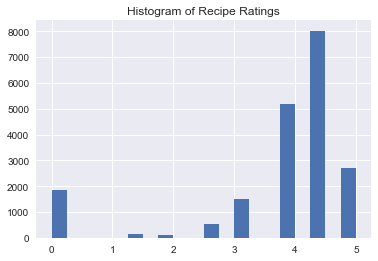
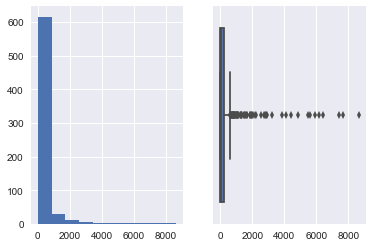
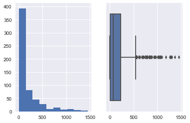

```python
import numpy as np
import pandas as pd
import scipy
import matplotlib.pyplot as plt
import seaborn as sns
%matplotlib inline
```


```python
raw_data = pd.read_csv('epi_r.csv')
```


```python
list(raw_data.columns)
raw_data.shape
```


    (20052, 680)


```python
raw_data.rating.describe()
```


    count    20052.000000
    mean         3.714467
    std          1.340829
    min          0.000000
    25%          3.750000
    50%          4.375000
    75%          4.375000
    max          5.000000
    Name: rating, dtype: float64


```python
raw_data.rating.hist(bins=20)
plt.title('Histogram of Recipe Ratings')
plt.show()
```





```python
# Count nulls 
null_count = raw_data.isnull().sum()
null_count[null_count>0]
```


    calories    4117
    protein     4162
    fat         4183
    sodium      4119
    dtype: int64


```python
from sklearn.svm import SVR
svr = SVR()
# X = raw_data.drop(['rating', 'title', 'calories', 'protein', 'fat', 'sodium'], 1)
# Y = raw_data.rating
# svr.fit(X,Y)
```


```python
# plt.scatter(Y, svr.predict(X))
```


```python
# svr.score(X, Y)
```


```python
from sklearn.model_selection import cross_val_score
# cross_val_score(svr, X, Y, cv=5)
```

__Challenge.__

Transform this regression problem into a binary classifier and clean up the feature set. You can choose whether or not to include nutritional information, but try to cut your feature set down to the 30 most valuable features.

Good luck!

# Notes & To Do:
1. Reduce Feature set
 - Sum all columns, transpose and then boxplot/histogram to drop top and bottom 25% (?)
 - Use ttests to get the best features from that set
     - For loop testing each column of the df against the the Y
 - Count how many features are left and plan accordingly
2. Turn SVR to SVC


```python
raw_data.drop_duplicates(keep='first',inplace=True)
```


```python
# Look at the tags

df_tags = raw_data.ix[:,6:]
totals = df_tags.sum()

plt.subplot(1,2,1)
plt.hist(totals)
plt.subplot(1,2,2)
sns.boxplot(totals)
plt.show()
totals.describe()
```





    count     674.000000
    mean      333.497033
    std       891.161223
    min         1.000000
    25%         9.000000
    50%        65.000000
    75%       253.000000
    max      8654.000000
    dtype: float64


```python
# Make the tags into proportions and look at the distribution

num_rows = raw_data.shape[0]
tag_proportion = totals/num_rows
tag_proportion.describe()
```


    count    674.000000
    mean       0.018273
    std        0.048828
    min        0.000055
    25%        0.000493
    50%        0.003561
    75%        0.013862
    max        0.474166
    dtype: float64


```python
# Try cleaning up by proportion. Leave in the higher values. Example: Bottom 5% and top 95%

q1  = totals.quantile(.05)
q3  = totals.quantile(.95)
totals_cleaned = totals.loc[(totals > q1) & 
                            (totals < q3)]

plt.subplot(1,2,1)
plt.hist(totals_cleaned)
plt.subplot(1,2,2)
sns.boxplot(totals_cleaned)
plt.show()
totals_cleaned.describe()
```





    count     595.000000
    mean      179.315966
    std       264.886522
    min         2.000000
    25%        12.000000
    50%        68.000000
    75%       227.000000
    max      1454.000000
    dtype: float64


```python
df = raw_data[list(totals_cleaned.index) + ['rating']]
```


```python
X = df.drop(['rating'], 1)
Y = df.rating
svr.fit(X,Y)
```


    SVR(C=1.0, cache_size=200, coef0=0.0, degree=3, epsilon=0.1, gamma='auto',
      kernel='rbf', max_iter=-1, shrinking=True, tol=0.001, verbose=False)


```python
svr.score(X, Y)
```


    0.021811263088270527


```python
cross_val_score(svr, X, Y, cv=5)
```


    array([-0.01490503,  0.02097735,  0.01006067, -0.00596128,  0.00935076])


```python
from scipy import stats

t_list = []
p_list = []
for col in raw_data.columns[raw_data.columns.isin(df_tags.columns)]:
    value = stats.f_oneway(*[value for name, value in raw_data.groupby('rating')[col]])
    t_list.append(value[0])
    p_list.append(value[1])
```


```python
df_setup = {'feature':raw_data.columns[raw_data.columns.isin(df_tags.columns)],
            't_value':t_list,
            'p_value':p_list, 
            'proportion':tag_proportion}
df_statistics = pd.DataFrame(df_setup)
df_statistics.reset_index(inplace=True,drop=True)
df_statistics.sort_values('t_value',ascending=False,inplace=True)
df_statistics
```


<div>
<table border="1" class="dataframe">
  <thead>
    <tr style="text-align: right;">
      <th></th>
      <th>feature</th>
      <th>p_value</th>
      <th>proportion</th>
      <th>t_value</th>
    </tr>
  </thead>
  <tbody>
    <tr>
      <th>186</th>
      <td>drink</td>
      <td>0.000000e+00</td>
      <td>0.058298</td>
      <td>308.837991</td>
    </tr>
    <tr>
      <th>8</th>
      <td>alcoholic</td>
      <td>0.000000e+00</td>
      <td>0.045093</td>
      <td>265.192820</td>
    </tr>
    <tr>
      <th>277</th>
      <td>house &amp; garden</td>
      <td>1.978288e-266</td>
      <td>0.024382</td>
      <td>185.328420</td>
    </tr>
    <tr>
      <th>235</th>
      <td>gin</td>
      <td>2.890704e-220</td>
      <td>0.012273</td>
      <td>152.849985</td>
    </tr>
    <tr>
      <th>133</th>
      <td>cocktail</td>
      <td>9.122826e-156</td>
      <td>0.020382</td>
      <td>108.046947</td>
    </tr>
    <tr>
      <th>580</th>
      <td>spirit</td>
      <td>4.395336e-130</td>
      <td>0.011835</td>
      <td>90.380346</td>
    </tr>
    <tr>
      <th>134</th>
      <td>cocktail party</td>
      <td>6.951335e-122</td>
      <td>0.060216</td>
      <td>84.759372</td>
    </tr>
    <tr>
      <th>50</th>
      <td>bitters</td>
      <td>5.000148e-111</td>
      <td>0.006849</td>
      <td>77.329406</td>
    </tr>
    <tr>
      <th>57</th>
      <td>bon appétit</td>
      <td>2.851787e-72</td>
      <td>0.474166</td>
      <td>50.908072</td>
    </tr>
    <tr>
      <th>262</th>
      <td>harpercollins</td>
      <td>4.598124e-67</td>
      <td>0.006630</td>
      <td>47.366386</td>
    </tr>
    <tr>
      <th>333</th>
      <td>liqueur</td>
      <td>1.465451e-62</td>
      <td>0.017040</td>
      <td>44.304147</td>
    </tr>
    <tr>
      <th>544</th>
      <td>sauté</td>
      <td>2.085264e-61</td>
      <td>0.105528</td>
      <td>43.520032</td>
    </tr>
    <tr>
      <th>32</th>
      <td>bake</td>
      <td>1.219962e-60</td>
      <td>0.225138</td>
      <td>42.998382</td>
    </tr>
    <tr>
      <th>240</th>
      <td>gourmet</td>
      <td>2.036130e-60</td>
      <td>0.326010</td>
      <td>42.847119</td>
    </tr>
    <tr>
      <th>502</th>
      <td>quick &amp; easy</td>
      <td>1.216165e-54</td>
      <td>0.265903</td>
      <td>38.919273</td>
    </tr>
    <tr>
      <th>635</th>
      <td>vegetable</td>
      <td>1.096679e-42</td>
      <td>0.105693</td>
      <td>30.782952</td>
    </tr>
    <tr>
      <th>453</th>
      <td>peanut free</td>
      <td>2.177777e-40</td>
      <td>0.421785</td>
      <td>29.216846</td>
    </tr>
    <tr>
      <th>526</th>
      <td>rum</td>
      <td>4.869961e-38</td>
      <td>0.017478</td>
      <td>27.614412</td>
    </tr>
    <tr>
      <th>574</th>
      <td>soy free</td>
      <td>5.429781e-38</td>
      <td>0.406279</td>
      <td>27.582168</td>
    </tr>
    <tr>
      <th>446</th>
      <td>pasta</td>
      <td>1.663016e-37</td>
      <td>0.051449</td>
      <td>27.250447</td>
    </tr>
    <tr>
      <th>204</th>
      <td>fall</td>
      <td>9.847001e-37</td>
      <td>0.150731</td>
      <td>26.723228</td>
    </tr>
    <tr>
      <th>407</th>
      <td>non-alcoholic</td>
      <td>1.415552e-35</td>
      <td>0.011287</td>
      <td>25.932745</td>
    </tr>
    <tr>
      <th>119</th>
      <td>chile pepper</td>
      <td>2.716396e-35</td>
      <td>0.011890</td>
      <td>25.739388</td>
    </tr>
    <tr>
      <th>195</th>
      <td>egypt</td>
      <td>4.656946e-33</td>
      <td>0.000055</td>
      <td>24.212346</td>
    </tr>
    <tr>
      <th>229</th>
      <td>fruit juice</td>
      <td>8.419754e-33</td>
      <td>0.025040</td>
      <td>24.036428</td>
    </tr>
    <tr>
      <th>63</th>
      <td>brandy</td>
      <td>9.948069e-32</td>
      <td>0.013917</td>
      <td>23.302607</td>
    </tr>
    <tr>
      <th>143</th>
      <td>condiment</td>
      <td>1.607891e-29</td>
      <td>0.004438</td>
      <td>21.789765</td>
    </tr>
    <tr>
      <th>624</th>
      <td>tree nut free</td>
      <td>4.510678e-27</td>
      <td>0.352036</td>
      <td>20.109819</td>
    </tr>
    <tr>
      <th>331</th>
      <td>lime juice</td>
      <td>2.663247e-26</td>
      <td>0.006739</td>
      <td>19.579819</td>
    </tr>
    <tr>
      <th>458</th>
      <td>pernod</td>
      <td>4.429987e-24</td>
      <td>0.002904</td>
      <td>18.050944</td>
    </tr>
    <tr>
      <th>...</th>
      <td>...</td>
      <td>...</td>
      <td>...</td>
      <td>...</td>
    </tr>
    <tr>
      <th>142</th>
      <td>columbus</td>
      <td>9.792412e-01</td>
      <td>0.000164</td>
      <td>0.226329</td>
    </tr>
    <tr>
      <th>62</th>
      <td>bran</td>
      <td>9.792412e-01</td>
      <td>0.000164</td>
      <td>0.226329</td>
    </tr>
    <tr>
      <th>223</th>
      <td>freezer food</td>
      <td>9.792412e-01</td>
      <td>0.000164</td>
      <td>0.226329</td>
    </tr>
    <tr>
      <th>630</th>
      <td>utah</td>
      <td>9.792412e-01</td>
      <td>0.000164</td>
      <td>0.226329</td>
    </tr>
    <tr>
      <th>667</th>
      <td>yuca</td>
      <td>9.803989e-01</td>
      <td>0.000329</td>
      <td>0.221910</td>
    </tr>
    <tr>
      <th>78</th>
      <td>buffalo</td>
      <td>9.803989e-01</td>
      <td>0.000329</td>
      <td>0.221910</td>
    </tr>
    <tr>
      <th>309</th>
      <td>kiwi</td>
      <td>9.810153e-01</td>
      <td>0.001863</td>
      <td>0.219494</td>
    </tr>
    <tr>
      <th>221</th>
      <td>frankenrecipe</td>
      <td>9.830353e-01</td>
      <td>0.000055</td>
      <td>0.211233</td>
    </tr>
    <tr>
      <th>80</th>
      <td>bulgaria</td>
      <td>9.830353e-01</td>
      <td>0.000055</td>
      <td>0.211233</td>
    </tr>
    <tr>
      <th>653</th>
      <td>westwood</td>
      <td>9.830353e-01</td>
      <td>0.000055</td>
      <td>0.211233</td>
    </tr>
    <tr>
      <th>431</th>
      <td>pacific palisades</td>
      <td>9.830353e-01</td>
      <td>0.000055</td>
      <td>0.211233</td>
    </tr>
    <tr>
      <th>652</th>
      <td>west virginia</td>
      <td>9.830353e-01</td>
      <td>0.000055</td>
      <td>0.211233</td>
    </tr>
    <tr>
      <th>25</th>
      <td>aspen</td>
      <td>9.830353e-01</td>
      <td>0.000055</td>
      <td>0.211233</td>
    </tr>
    <tr>
      <th>279</th>
      <td>houston</td>
      <td>9.830353e-01</td>
      <td>0.000055</td>
      <td>0.211233</td>
    </tr>
    <tr>
      <th>659</th>
      <td>windsor</td>
      <td>9.830353e-01</td>
      <td>0.000055</td>
      <td>0.211233</td>
    </tr>
    <tr>
      <th>397</th>
      <td>new hampshire</td>
      <td>9.830353e-01</td>
      <td>0.000055</td>
      <td>0.211233</td>
    </tr>
    <tr>
      <th>243</th>
      <td>grand marnier</td>
      <td>9.830353e-01</td>
      <td>0.000055</td>
      <td>0.211233</td>
    </tr>
    <tr>
      <th>495</th>
      <td>providence</td>
      <td>9.830353e-01</td>
      <td>0.000055</td>
      <td>0.211233</td>
    </tr>
    <tr>
      <th>254</th>
      <td>guam</td>
      <td>9.830353e-01</td>
      <td>0.000055</td>
      <td>0.211233</td>
    </tr>
    <tr>
      <th>47</th>
      <td>beverly hills</td>
      <td>9.830353e-01</td>
      <td>0.000055</td>
      <td>0.211233</td>
    </tr>
    <tr>
      <th>335</th>
      <td>london</td>
      <td>9.830353e-01</td>
      <td>0.000055</td>
      <td>0.211233</td>
    </tr>
    <tr>
      <th>199</th>
      <td>england</td>
      <td>9.830353e-01</td>
      <td>0.000055</td>
      <td>0.211233</td>
    </tr>
    <tr>
      <th>18</th>
      <td>apple juice</td>
      <td>9.833866e-01</td>
      <td>0.000329</td>
      <td>0.209738</td>
    </tr>
    <tr>
      <th>459</th>
      <td>persian new year</td>
      <td>9.869648e-01</td>
      <td>0.000219</td>
      <td>0.193280</td>
    </tr>
    <tr>
      <th>373</th>
      <td>miami</td>
      <td>9.918601e-01</td>
      <td>0.000110</td>
      <td>0.165424</td>
    </tr>
    <tr>
      <th>290</th>
      <td>israel</td>
      <td>9.918601e-01</td>
      <td>0.000110</td>
      <td>0.165424</td>
    </tr>
    <tr>
      <th>283</th>
      <td>iced coffee</td>
      <td>9.918601e-01</td>
      <td>0.000110</td>
      <td>0.165424</td>
    </tr>
    <tr>
      <th>182</th>
      <td>dominican republic</td>
      <td>9.918601e-01</td>
      <td>0.000110</td>
      <td>0.165424</td>
    </tr>
    <tr>
      <th>378</th>
      <td>minneapolis</td>
      <td>9.918601e-01</td>
      <td>0.000110</td>
      <td>0.165424</td>
    </tr>
    <tr>
      <th>363</th>
      <td>martini</td>
      <td>9.940508e-01</td>
      <td>0.000384</td>
      <td>0.149422</td>
    </tr>
  </tbody>
</table>
<p>674 rows × 4 columns</p>
</div>


```python
feature_set = df_statistics[df_statistics['p_value'] < .05]['feature']

X = raw_data[feature_set]
Y = raw_data['rating']
```


```python
cross_val_score(svr, X, Y, cv=5)
```


    array([ 0.03111886,  0.07114008,  0.0614486 ,  0.05205707,  0.06268361])


# I made a terrible model less terrible
